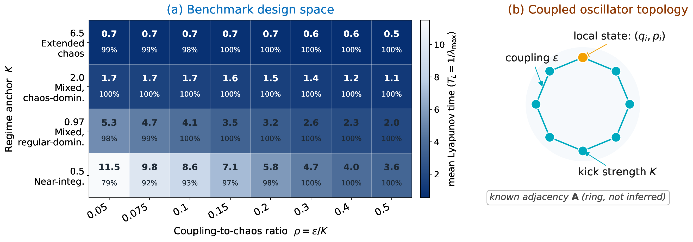

# ChaosNetBench

[](https://www.python.org/downloads/)
[](https://pytorch.org/)
[](LICENSE)

**ChaosNetBench: Benchmarking Spatio-Temporal Graph Neural Networks on Chaotic Lattice Dynamics**

Official codebase and public benchmark interface for ChaosNetBench.



ChaosNetBench is a controlled benchmark for studying spatio-temporal graph neural networks (STGNNs) on the lattice of coupled standard maps with known topology, tunable chaotic regimes, and initial condition based evaluation.

## Links

- Paper: https://arxiv.org/abs/2605.09676
- Dataset: https://huggingface.co/datasets/htmoges/chaosnetbench-cml
- Maintainer: H. T. Moges
- Contact: ht.moges@gmail.com
- Homepage: https://htmoges.github.io

**Physical system:** The Coupled Standard Map (Chirikov-Taylor map on a ring lattice) was introduced as the benchmark dynamical system in:

> H. T. Moges, T. Manos, Ch. Skokos (2022). *Anomalous diffusion in single and coupled standard maps with extensive chaotic phase spaces.* Physica D: Nonlinear Phenomena, 431, 133120. https://doi.org/10.1016/j.physd.2021.133120

## Get Started

### 1. Install Dependencies

```bash
git clone https://github.com/htmoges/ChaosNetBench
cd ChaosNetBench
pip install -r requirements.txt
pip install -e .
```

### 2. Download the Dataset

Download the public benchmark dataset from Hugging Face:

```bash
pip install huggingface_hub
python -c "from huggingface_hub import hf_hub_download; \
    hf_hub_download(repo_id='htmoges/chaosnetbench-cml', \
    filename='data/chaosnetbench_cml.h5', repo_type='dataset', \
    local_dir='data/')"
```

For a quick local smoke test without downloading the full dataset, a mini subset
is already included at `data/chaosnetbench_cml_mini.h5`.

Dataset schema, metadata, and Croissant records are documented in [data/README.md](data/README.md).

### 3. Run a Quick Experiment

```bash
python scripts/train.py \
    --model graph_wavenet \
    --K 2.0 --rho 0.20 --N 8 \
    --seed 42
```

Or use the included mini dataset for a quick end-to-end test (no download needed):

```bash
python scripts/train.py \
    --model dlinear \
    --K 0.5 --rho 0.10 --N 8 \
    --seed 42 \
    --dataset data/chaosnetbench_cml_mini.h5
```

## Included In This Release

- Core benchmark package: `chaosnetbench/` (systems, dataset loading, metrics, models, training)
- Benchmark entry-point scripts: `scripts/train.py`, `scripts/sweep.py`, `scripts/analyze_results.py`
- Mini dataset for local smoke testing: `data/chaosnetbench_cml_mini.h5`
- Aggregate benchmark results: `results/chaosnetbench_cml_results.csv`
- Benchmark configuration: `configs/benchmark.yaml`

The full dataset (27.3 GB HDF5) is hosted on [Hugging Face](https://huggingface.co/datasets/htmoges/chaosnetbench-cml).
Benchmark protocol details are in the paper and [data/README.md](data/README.md).

## Citation

If you use this code or dataset, please cite the associated paper.

```bibtex
@misc{moges2026chaosnetbench,
  title  = {ChaosNetBench: Benchmarking Spatio-Temporal Graph Neural Networks on Chaotic Lattice Dynamics},
  author = {Henok Tenaw Moges and Charalampos Skokos and Deshendran Moodley},
  year   = {2026},
    doi    = {10.48550/arXiv.2605.09676},
    url    = {https://arxiv.org/abs/2605.09676}
}
```

## License

MIT License. See [LICENSE](LICENSE).
